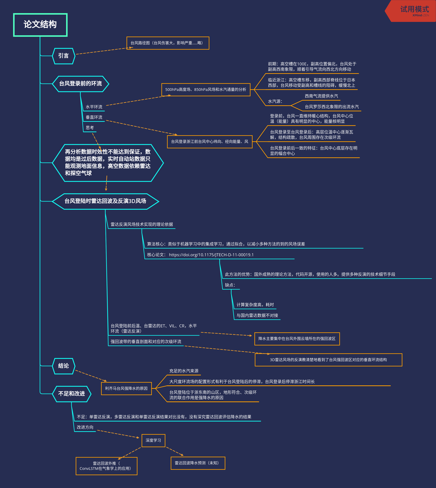
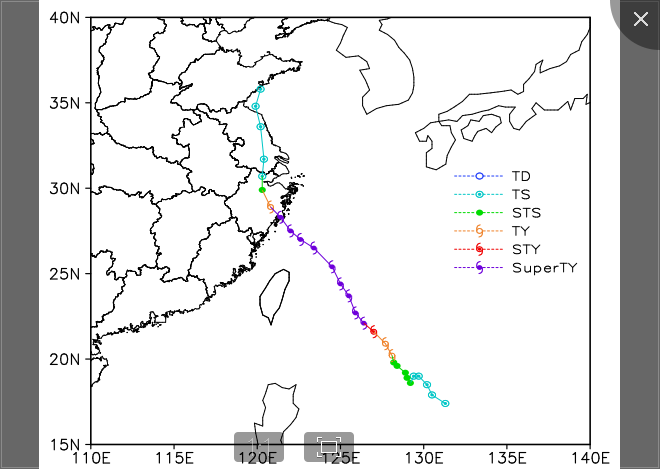
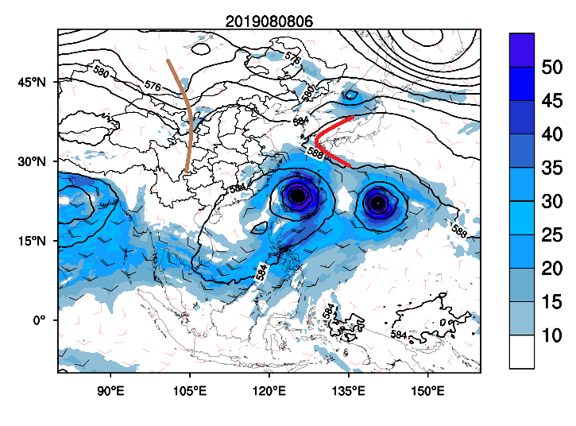
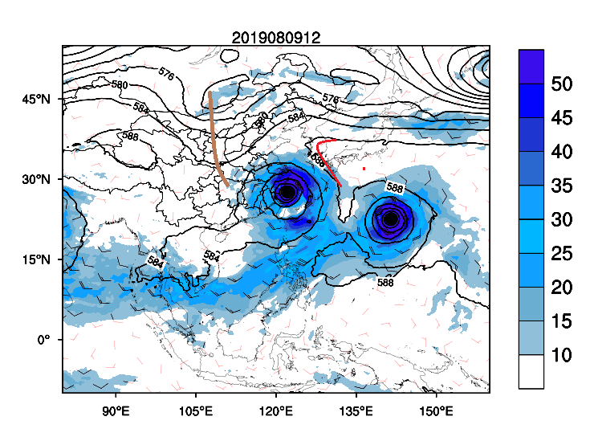
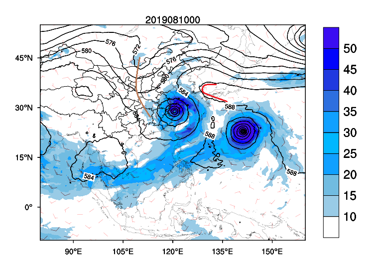
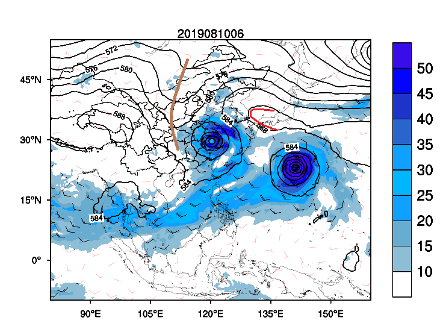
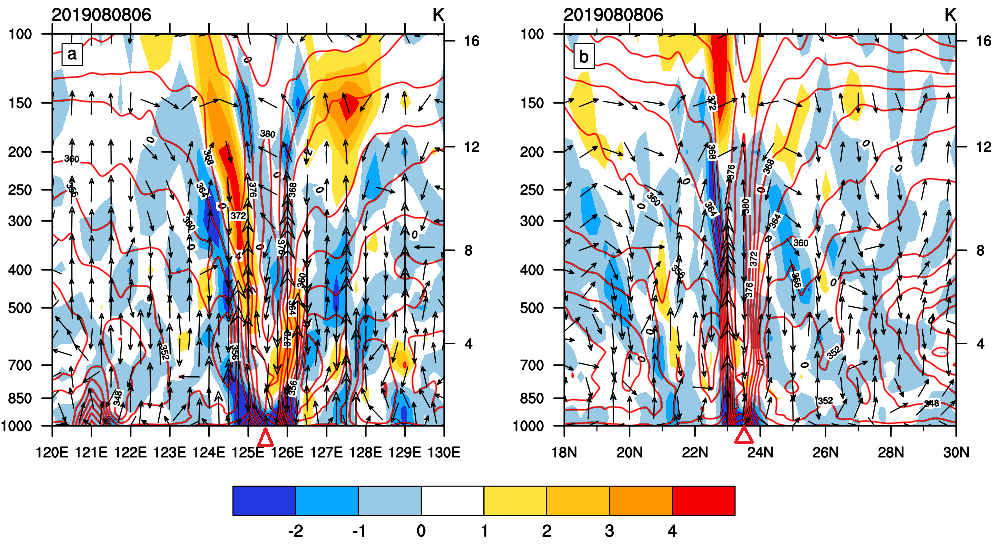
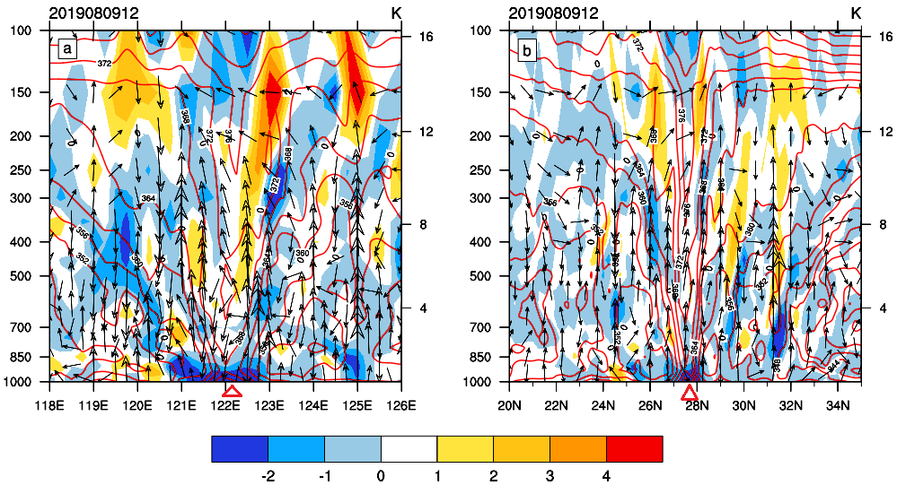
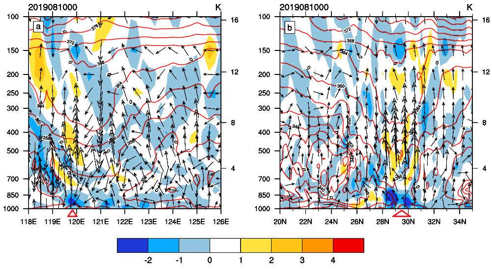
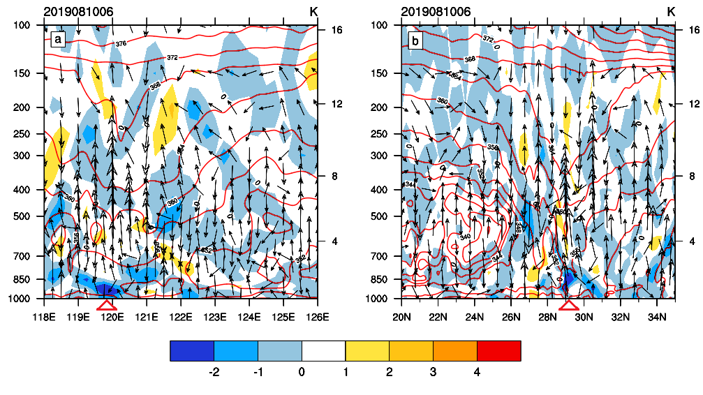

# Typhoon_LMQ
这是一个有关台风利齐马登陆浙江前后风雨情况的仓库

# 利齐马台风登录是雷达反演的3D风场结构特征分析

# 论文基本图片和结论

## 前言

**略**

## 台风概况

**论述要点**
1.  台风的生命历程
2.  台风在近海缓慢移动
3.  台风长时间停滞浙江

此次台风损失巨大，那么为什么会如此呢？从台风登陆前，环境场的分析来看

## 环流形式

|a|b|
|-|-|
|||

|c|d|
|-|-|
|||

**论述要点**
1.  高空槽和副热带高压的位置，是台风先西北移动，之后向北缓慢移动的原因
2.  强劲的西南气流和台风罗莎源源不断的向利齐马输送水汽

**结论**：台风登录前一直保持高能高水汽，并且登录后停滞时间长

|a|b|
|-|-|
|||

|c|d|
|-|-|
|||

**论述要点**
1. 台风登录前，一直保持着高能量，高强度
2. 台风登陆后，高层能量消失
3. 底层自始至终有一个强的幅合层
4. 台风强回波带的持续时间最长

### 垂直结构

### 可降水率的分析